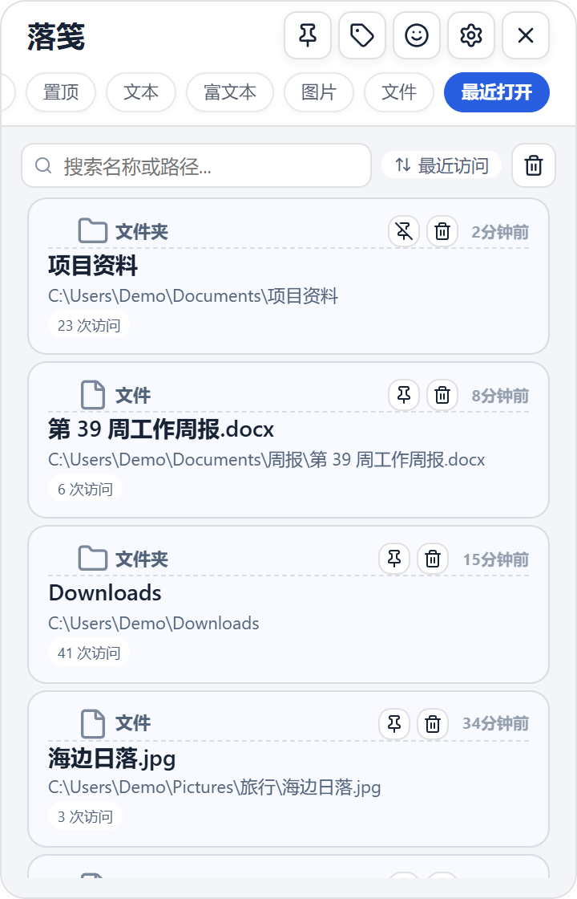
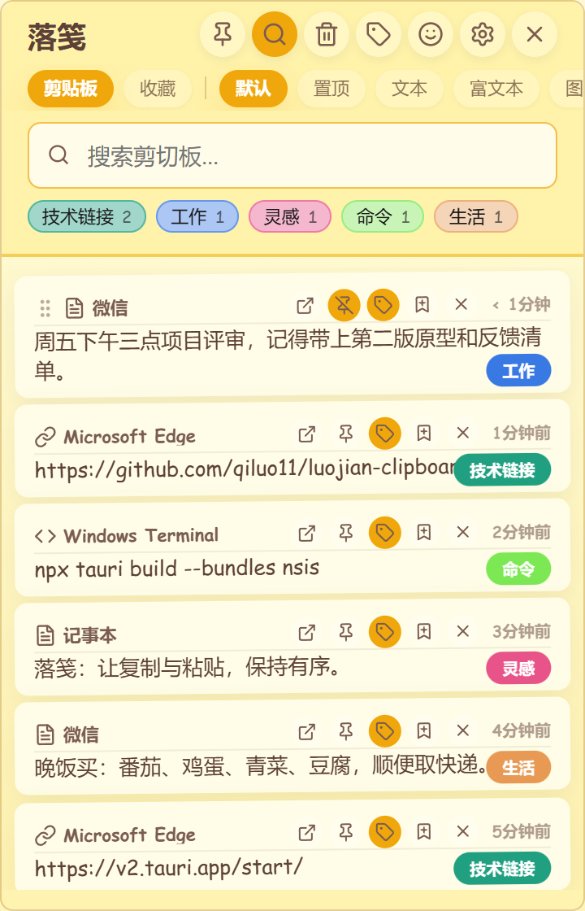
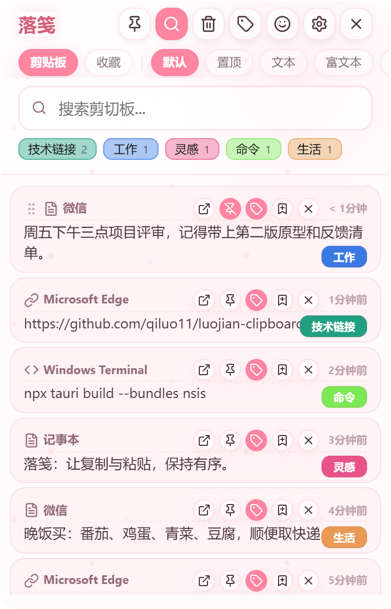
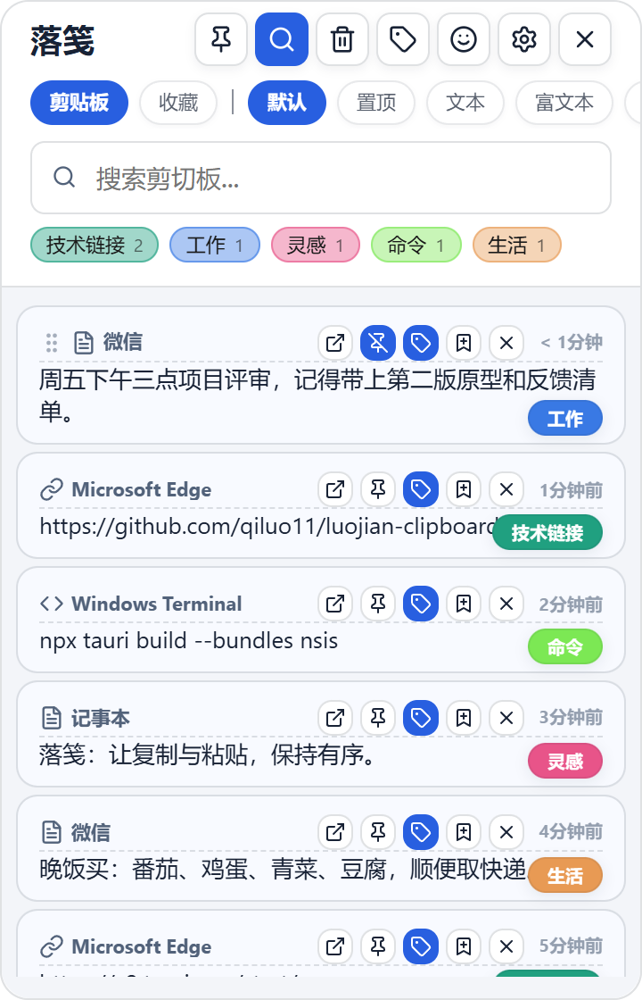
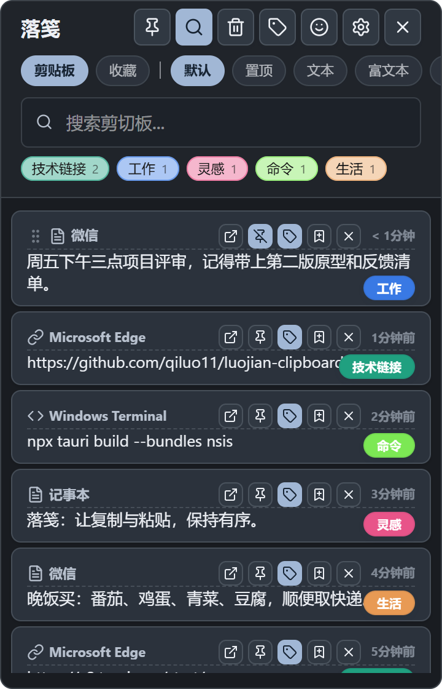

  

  # LuoJian (落笺)

  **LESS FRICTION. MORE FLOW.**

  
  
  
  

  [简体中文](./README.md) | [English](./README.en.md)

---

LuoJian is a clipboard manager for Windows. It is a modified version of the open-source project [**TieZ**](https://github.com/jimuzhe/tiez-clipboard) by LongDz (jimuzhe), licensed under GPL-3.0, maintained by [qiluo11](https://github.com/qiluo11). It keeps TieZ's clipboard history, tags, themes and privacy masking, and focuses on favorites, recently opened files, tag organization, web AI, hotkeys and themes.

> LuoJian is not an official TieZ release and is not affiliated with the original author. Please report problems with the original app in the [TieZ repository](https://github.com/jimuzhe/tiez-clipboard).

## What changed (compared with TieZ 0.3.3)

| Area | Changes in LuoJian |
| :--- | :--- |
| **Favorites** | Separate favorites with groups, custom titles, in-group search, drag-and-drop ordering, move and delete. |
| **Recently opened** | Files and folders opened in Explorer or listed in Recent; search, pin, sort by time, count, name or manually; left-click to open. |
| **Organize** | Pinned items can live on their own page instead of crowding the history; the tag page adapts to narrow windows with batch actions on a separate row; per-tag regex rules sort new items automatically. |
| **Web AI** | Right-click an item, pick a prompt (translate, summarize, polish, or your own), and LuoJian opens the web AI and pastes for you. Each site has its own wait time, and the foreground window is checked to be a browser before pasting. |
| **Context menu** | Right-click opens a menu instead of pasting immediately; favorites, web AI and properties are grouped there, and the menu stays inside the window. |
| **Hotkeys** | Readable key names (e.g. Alt + F); more reliable re-recording; a failed save keeps the old binding. Alt+F or the search button toggles the search bar at any time. |
| **Themes** | 8 themes instead of 5 (new: Modern Minimal and Graphite; Sakura is inherited from upstream); notifications and menus follow the theme. |
| **Startup** | No window flash on silent start; the autostart path repairs itself. |
| **File transfer** | LAN file transfer is kept and shown directly in Settings; fixed "Auto close server", pasting images in the chat, switching the displayed IP and copying download links, which did not work in the original. |
| **Leaner** | Removed official announcements, website promotion, online updates, MQTT / WebDAV cloud sync and the old API AI (web AI is kept); smaller installer. |
| **Memory** | After the window has been hidden for a while, WebView2 memory use is lowered automatically, so LuoJian stays light in the background. |

   
  The "Recently opened" page: files and folders you used recently — search, pin, sort, left-click to open (demo data).

## Moving from TieZ

- LuoJian uses its own identifier `io.github.qiluo11.luojian` and stores data in `%APPDATA%\io.github.qiluo11.luojian`, so it can be installed alongside TieZ.
- On **first launch**, if TieZ data exists in `%APPDATA%\com.tiez` (including a custom folder set via `datapath.txt`), LuoJian **copies** the database, attachments, emoji favorites and custom background. Your TieZ data is never moved or deleted.
- The import runs only once and is recorded in `legacy-import.txt` in the new data folder.
- If you no longer use TieZ, uninstall it so the two apps do not both start with Windows.

## Inherited from TieZ

- Built with Tauri 2 and Rust: light and fast.
- Captures text, rich text, images, files and paths; search by content, source app, tag or date.
- Colored tags, emoji panel, edge docking, sequential paste, edit in an external editor.
- LAN file transfer: scan a QR code with your phone and exchange text, images and files with the PC in the browser, no phone app needed.
- Mica / acrylic backgrounds and dark mode.
- Masks ID numbers, phone numbers, email addresses and similar data in previews.

## Themes

<table>
  <tr>
    <td align="center"><b>Sticky note</b> </td>
    <td align="center"><b>Sakura</b> </td>
    <td align="center"><b>Modern Minimal</b> </td>
    <td align="center"><b>Graphite (dark)</b> </td>
  </tr>
</table>

Screenshots are taken from the LuoJian 0.1.0 UI test page with demo data. Other themes — 3D retro, Mica, Acrylic and Paper book — can be switched in Settings, each with light and dark modes.

## System requirements

| Platform | Requirements | Package |
| :--- | :--- | :--- |
| Windows | Windows 10 / 11 (x64) | NSIS installer `LuoJian_<version>_x64-setup.exe` |

## License and credits

- Released under the [GNU General Public License v3.0](./LICENSE). You may use, modify and redistribute it, but redistributions must stay under GPL-3.0 and include the complete source code. This program comes with **no warranty**.
- Original project: [jimuzhe/tiez-clipboard](https://github.com/jimuzhe/tiez-clipboard), Copyright (C) 2026 LongDz.
- Modifications: Copyright (C) 2026 qiluo11, starting September 2026. See [`NOTICE.md`](./NOTICE.md) for a summary of the changes and dates.
- Source code: <https://github.com/qiluo11/luojian-clipboard>
- Thanks to the TieZ author and contributors, and to the Tauri, React and Rust communities and all dependency authors; each dependency is used under its own license.
